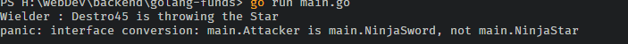

# Type Assertions

**A type assertion provides access to an interface value's underlying concrete value.**


<small style="display:inline-block;text-align:center;width:100%;">Photo By : [Alfrey Davilla](https://dribbble.com/vaneltia)</small>

---

## Now Let's have a look at this code

```go
import "fmt"

type NinjaSword struct {
 Wielder string
}
type NinjaStar struct {
 Wielder string
}
type UnknownMystical struct {
 Wielder string
}

type Attacker interface {
 Attack()
}

func (ns NinjaStar) Attack() {
 fmt.Printf("Wielder: %s is throwing the Star" , ns.Wielder)
}
func (ns NinjaSword) Attack() {
 fmt.Printf("Wielder: %s is swinging the sword" , ns.Wielder)
}

func (ns NinjaStar) somethingOnlySpecificToNinjaStar() {
 fmt.Printf("I'm Specific to NinjaStar")
}
func (ns NinjaSword) somethingOnlySpecificToNinjaSword() {
 fmt.Printf("I'm Specific to NinjaSword")
}

func UseWeapons(att []Attacker){
 for _ , weapon := range attackingWeapons{
  weapon.Attack()
 }
}

```

**This Will result in a compile error as UnkownMystical doesn’t implement the Attack method**

```go
 x:= []Attacker{
   NinjaStar{},
   UnknownMystical{},
  }

```

**How About This Code**

```go

attackingWeapons := []Attacker{
  NinjaStar{ Wielder: "Destro45"},
  NinjaSword{ Wielder: "Destro45"},
 }

 for _ , weapon := range attackingWeapons{
  weapon.Attack()
 }

```

This code will compile and work correctly during runtime, as both concrete types implement the "attack" method. Therefore, they are also attacker types I mention this because, in Go, interfaces are implicit.

> **if it moves like a duck and quacks like a duck, then it's probably a duck**

**However And this is important. Interfaces if you think about it are features or traits you add to your… and this is the most important keyword here Concrete Type !!**

So what if I want to use the features specific to that concrete type ??

---

Here Come **Type Assertions 🥳 🥳 🥳:**

```go
attackingWeapons := []Attacker{
  NinjaStar{ Wielder: "Destro45"},
  NinjaSword{ Wielder: "Destro45"},
 }

 for _ , weapon := range attackingWeapons{
  weapon.(NinjaStar).Attack()
}
```

**If you paid attention you will predict if this produces an error or not**

…and the answer is yes of course !! as both of them have the attacker “feature” however the underlying concrete types are not the same

---

**However, let’s analyze this even more**

When does this error take place?

Huh? “Visibly confused **😕”**

During runtime? → Yup however there’s more

Is the error will arise immediately when I run the program or something will happen first?

---

**If you take a look at the order of the elements in that array**

1. element with type NinjaStar
2. element with type NinjaSword

The first iteration → type assertion works fine as the concrete type (**NinjaStar**) aligns with the type I’m asserting to which is **NinjaStar**

The second iteration → type assertion results in a panic state (runtime error) and the program crashes as the concrete type (**NinjaSword**) doesn’t align with the type I'm asserting to which is also **NinjaStar**

Oh, wait what happens if I swap those elements do I get a runtime error immediately? → YUP **🥳** !!!!

---

## Now Let's run the code in both cases

**First Case:**

```bash
attackingWeapons := []Attacker{
  NinjaStar{ Wielder: "Destro45"},
  NinjaSword{ Wielder: "Destro45"},
}

for _ , weapon := range attackingWeapons{
  weapon.(NinjaStar).Attack()
}
```



**Second Case:**

```bash
attackingWeapons := []Attacker{
 NinjaSword{ Wielder: "Destro45"},
 NinjaStar{ Wielder: "Destro45"},
}

for _ , weapon := range attackingWeapons{
  weapon.(NinjaStar).Attack()
}
```


---

So all hope is lost I can’t use it with different concrete types that doesn’t seem logical isn’t it?

Yup it doesn’t however before i show the solution let’s just imagine use cases for this type assertion

1- a function that takes the interface type however i want a specific concrete type to process something on first

2- calling functions specific to that concrete type

lets see how this works

asserting returns two variables

1. The concrete type instance
2. boolean value indicating wether the asserting was successful or not

```go
func OnlyCallAttackOnNinjaStar( att []Attacker  ){
for _ , weapon := range att{
  val, ok := weapon.(NinjaStar)
  if(ok){
   val.Attack()
  }
   // alternate syntax
  // if val, ok := weapon.(NinjaStar); ok {
  // val.Attack()
  // }
  // CHECK LINKS SECTION
 }
}
OnlyCallAttackOnNinjaStar(attackingWeapons)
// of course i can just do this directly in this specific example -> NinjaStar.Attack()

```

Now let’s go for a more real of a usecase which is calling functions specific to that concrete type

```go
func callConcreteTypesSpecificFunctions( att []Attacker  ){
for _ , weapon := range att{
  val, ok := weapon.(NinjaStar)
  val, ok := weapon.(NinjaSword)
  // wait wat ??!
  if(ok){
   val.Attack()
  }
}
}
callConcreteTypesSpecificFunctions(attackingWeapons)
```

OF COURSE I CAN’T DO THAT THIS IS PROGRAMMING 101 🤯🤯🤯 i can’t event complete to

type that as it will not work duuhh

of course it will work just fine for only one type

```go
func callConcreteTypesSpecificFunctions( att []Attacker  ){
for _ , weapon := range att{
  val, ok := weapon.(NinjaStar)
  if(ok){
   val.somethingOnlySpecificToNinjaStar()
  }
}
}
callConcreteTypesSpecificFunctions(attackingWeapons)
```

SO wait what if i want to do different things based on the various concrete types that implemenet attacker ???

HERE COMES **TYPE SWITCHING 🥳🥳🥳 !!!!!**

---

## Type Switching

Allows us to do various type assertions

And Here’s how callConcreteTypesSpecificFunctions() should’ve been written

```go
func callConcreteTypesSpecificFunctionsV2( att []Attacker  ){
for _ , weapon := range att{
 switch v := weapon .(type) {
  case NinjaStar:
   v.somethingOnlySpecificToNinjaStar()
  case NinjaSword:
   v.somethingOnlySpecificToNinjaSword()
  default:
   fmt.Printf("I don't know about type %T!\n", v)
 }
  weapon.Attack()
}
}
callConcreteTypesSpecificFunctionsV2(attackingWeapons)
```

---

## Links

We Can improve that code even more in Using [Struct Embedding](struct-embedding)

For The Complete and Improved Code Check out This Repo [Here](https://github.com/Kokosalah45/golang-funds/tree/main/type-assertion)

Type Assertion : [https://go.dev/tour/methods/15#:~:text=A type assertion provides access,statement will trigger a panic](https://go.dev/tour/methods/15#:~:text=A%20type%20assertion%20provides%20access,statement%20will%20trigger%20a%20panic).

Type Switches : [https://go.dev/tour/methods/16](https://go.dev/tour/methods/16)

if Shorthand : [https://go.dev/tour/flowcontrol/6](https://go.dev/tour/flowcontrol/6)

Golang Dojo Type Asserion : [https://www.youtube.com/watch?v=ijX4S6-6zn4&list=RDCMUCEXtPiqFrcdzFRKqwazI1NA&index=2](https://www.youtube.com/watch?v=ijX4S6-6zn4&list=RDCMUCEXtPiqFrcdzFRKqwazI1NA&index=2)

Golang Dojo Type Switching : [https://www.youtube.com/watch?v=nl38Bo9CLk0](https://www.youtube.com/watch?v=nl38Bo9CLk0)
